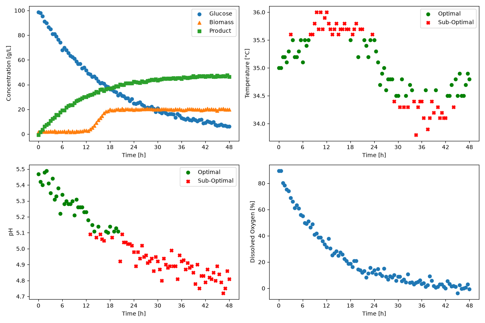

# BioBatch Monitor

A Python-based bioprocess monitoring tool that analyzes fermentation batch data, identifies optimal operating conditions, and automatically generates process dashboards and batch summary tables.

## Overview

The goal of this project is to automate the monitoring and analysis of fermentation batch processes.

The program evaluates important process variables such as pH and temperature to determine whether measurements remain within specified operating ranges. It also visualizes key fermentation variables over time and generates summary statistics for each batch.

The project is designed to make fermentation data easier to analyze by automatically producing both graphical dashboards and batch-level performance summaries.

## Features

The custom `BioprocessMonitor` class can:

- Load fermentation process data from a CSV file.
- Extract data for individual fermentation batches.
- Determine whether pH measurements are within an acceptable operating range.
- Determine whether temperature measurements are within an acceptable operating range.
- Count the number of batches contained in the dataset.
- Generate a four-panel dashboard for each batch.
- Distinguish optimal and sub-optimal pH and temperature measurements.
- Calculate the percentage of measurements within acceptable pH and temperature ranges.
- Determine the final product concentration for each batch.
- Export batch summary tables as CSV files.

## Technologies Used

- Python 3.14.7
- pandas — data loading, filtering, analysis, and table generation
- matplotlib — data visualization and dashboard generation

## Code Design

The program is executed through `main.py`.

When `main.py` is run:

1. The fermentation dataset is loaded from the `datasets` directory.
2. A `BioprocessMonitor` object is created for each set of operating conditions.
3. The program determines the number of fermentation batches in the dataset.
4. Each batch is extracted and analyzed individually.
5. pH and temperature measurements are classified as optimal or sub-optimal.
6. A dashboard is generated for every batch and saved in the `figures` directory.
7. A summary table is created for each operating mode and saved in the `tables` directory.

The main data-processing and visualization methods are contained within the `BioprocessMonitor` class in `src/classes.py`.

## Dashboard

The following dashboard shows the fermentation profile for Batch 1 under Mode B operating conditions.

|batch_id|ph_optimal_percent|temperature_optimal_percent|C_product_g_L^-1_final|
|--------|------------------|---------------------------|----------------------|
|1       |36.08             |51.55                      |46.5                  |
|2       |34.71             |55.37                      |50.8                  |
|3       |36.99             |46.58                      |44.6                  |
|4       |54.12             |62.35                      |48.6                  |
|5       |16.51             |49.54                      |24.7                  |

The dashboard contains four plots:

- Top-left: Glucose, biomass, and product concentrations over time.
- Top-right: Temperature over time. Green circles represent measurements within the acceptable operating range, while red X markers represent sub-optimal measurements.
- Bottom-left: pH over time. Optimal measurements are shown as green circles and sub-optimal measurements as red X markers.
- Bottom-right: Dissolved oxygen concentration over time.

Together, these plots provide a quick overview of process performance and make it possible to identify periods where operating conditions move outside the desired ranges.

## Summary Table

[Summary_Mode_B.md](../Summary_Mode_B.md)
The summary table provides one row for each fermentation batch.

- `ph_optimal_percent` represents the percentage of pH measurements within the acceptable range.
- `temperature_optimal_percent` represents the percentage of temperature measurements within the acceptable range.
- `C_product_g_L^-1_final` represents the final measured product concentration for the batch.

This summary makes it easy to compare process performance between batches and identify batches that experienced less favorable operating conditions.